# Product MVP Validator Skill

This skill enforces Lean Startup / Build-Measure-Learn validation principles for the **AI-Powered QR Inventory / QR AI Menu** project. It keeps development focused on the core riskiest assumptions and prevents scope creep.

## Core Vision & Hypothesis
* **Vision**: A QR-based catalog system where staff add items with rich descriptions, and customers query them in natural language (e.g. *"something spicy for 2 people"*, *"shoes for muddy trekking"*) instead of scrolling menus or shelves.
* **Riskiest Assumption (Hypothesis)**: **AI semantic/descriptive search returns results customers perceive as relevant and better/faster than browsing a plain list/filter.**
* **Core Goal**: Validate this hypothesis within a **3-Day Sprint** using a team of 4 (or a multi-agent team).

---

## 3-Day Sprint Timeline & Guardrails

Use this checklist during development to verify progress and maintain constraints:

```mermaid
gantt
    title 3-Day Sprint Timeline
    dateFormat  D
    section Sprint Phases
    Day 1 - Foundations & Skeleton :active, d1, 0, 1d
    Day 2 - Core Loop & AI integration : d2, after d1, 1d
    Day 3 - Measure, Learn & Polish : d3, after d2, 1d
```

### Day 1 Checklist: Foundations & Skeleton
- [ ] Align database schema and API contracts.
- [ ] Set up simple FastAPI backend and Next.js frontend skeleton.
- [ ] Verify that a client can add an item, save it to the database, and display it in a plain text list (no AI/vector search yet).
- [ ] Prepare baseline seed datasets (10-15 menu items, 10-15 footwear items with descriptive tags).

### Day 2 Checklist: Core Loop & AI Integration
- [ ] Enable auto-embedding generation on item save.
- [ ] Build `/api/query` endpoint with vector similarity search (Supabase + `pgvector`).
- [ ] Implement optional LLM re-ranking and one-line explanations ("Why this matches").
- [ ] Connect Next.js frontend search page to the backend `/api/query` endpoint.
- [ ] Validate end-to-end: scanning a QR code redirects to the customer catalog page, allowing natural language queries that yield relevant results.

### Day 3 Checklist: Measure, Learn & Polish
- [ ] Conduct full team QA using seed data on actual mobile devices.
- [ ] Implement **Innovation Accounting** logging (query text, returned results, user selections, and thumbs up/down feedback).
- [ ] Recruit 5-10 testers to scan, search, and capture metrics.
- [ ] Run Build-Measure-Learn review: Did semantic search beat a scrolling list? Decide to persevere or pivot.

---

## MVP Scope Guardrails (Strict Constraints)

Do NOT implement the following features during the MVP phase. Cut them ruthlessly:
* **No Real Admin Auth**: A shared, hardcoded `business_slug` or PIN is sufficient. Do not build User/Role management.
* **No Multi-Tenancy Hardening**: Optimize for a single/few test businesses first.
* **No Payments/Ordering**: The MVP only tests discovery, not transaction.
* **No Stock/Inventory Tracking**: Skip quantity levels, alerts, and stock adjustments.
* **No Native Apps**: Web-only, but mobile-responsive/phone-first.
* **No Advanced Analytics Dashboards**: Log events to the database. Do not write complex charts or dashboards.
* **No Edit/Delete Items**: Add-only is sufficient to seed and test.
* **No Complex Multi-Language Support**: If Malayalam/local language is required, use a simple translation workaround (Translate MAL -> ENG -> Query -> Translate back) or skip entirely for the MVP.

---

## References & Metrics Guide
For detailed instructions on capturing product metrics and event logging, refer to:
[metrics.md](./references/metrics.md)
